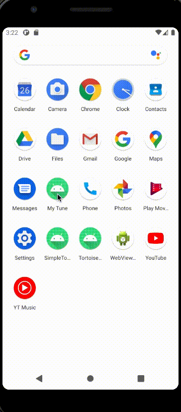
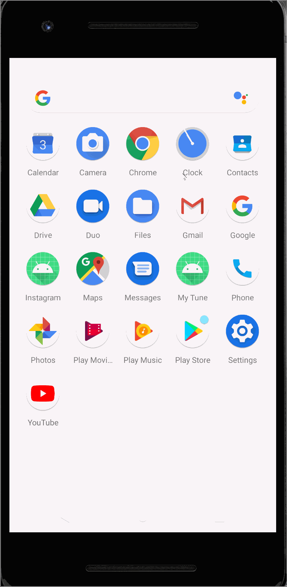

# Mytune

## Table of Contents
1. [Overview](#Overview)
1. [Product Spec](#Product-Spec)
1. [Wireframes](#Wireframes)
2. [Schema](#Schema)

## Overview
### Description
With MyTune app, discover and meet musicians from all around the world. MyTun is an app that is built for people who enjoy creating, sharing, or just listening to music.
All you have to do is listen and engage with what you like, skip what you don't, and you'll find yourself scrolling through an endless stream of posts that has all types of music.
Explore tons of playlists and listen to music while meeting new people!a

### App Evaluation
[Evaluation of your app across the following attributes]
- **Category:** social media
- **Mobile:** Anyone is free to share their singing, talks about some knowlege of musics. It is view and uses camera.
- **Story:**
- **Market:** It is for anyone who wants to listen and watch videos that are music.
- **Habit:** Musical interest
- **Scope:** A social meadia that shares music, musical ideas, the record of their singing, making firends, and gainning followers. 

## Product Spec

### 1. User Stories (Required and Optional)

**Required Must-have Stories**
* [] Fill in your required user stories here
* [] User can register a new account 
* [x] User can login
* [] User profile that shows his username, favoriate songs, and general information about the user.
* [] User can upload his own music in a post
* [] User can listen to other people songs
* [] User can like/comment on other people shared songs
* [] User can create/save have his own playlists

**Optional Nice-to-have Stories**

* [fill in your required user stories here]
* User can set a sleep timer
* User can switch btween night/day mode
* User can see the history of all songs he liked
* ...

### 2. Screen Archetypes

* [Login]
   * [Create login page]
   * [Create a register account page]
   * ...
* [Profile]
   * [Recorded music]
   * [Liked posts]
   * [Playlists]
   * [Profile picture]
   * [Email]
   * [DOB]
   * [Username]
   * [liked Videos]
   * [favorite songs]
   * [watched history]
   * [Your posts]
   * ...
   * ...
* [Posts]
   * [Posts of other users]
   * [Save playlist from the other users]
    * [View Profile picture of the users, posting date]
    * [Recordings, pictures, descirption]
    * [Like buttons, not interested, rating stars, comments, share buttons, follow button]

### 3. Navigation

**Tab Navigation** (Tab to Screen)

* [Posts]
* [User/Profile]
* [Record]
* [Login]

**Flow Navigation** (Screen to Screen)

* [Posts]

   * ...
* [Pofile]


## Wireframes
[Add picture of your hand sketched wireframes in this section]


### [BONUS] Digital Wireframes & Mockups

### [BONUS] Interactive Prototype

## Schema 
[This section will be completed in Unit 9]
### Models
[Add table of models]
|    Property     |      Type       |                       Description                   |
|     :---:       |     :---:       |                         :---:                       |
|     author      | Pointer to User |                     Image Author                    |                 
|     audio       |      File       |                  Audio that user posts              |
|    caption      |     String      |        Caption that author posts with the audio     |
|  CommentsCount  |     Number      | number of comments that has been posted to a post   |
|   likesCount    |     Number      |          Number of likes that a post got            |
|   CreatedAt     |    DateTime     |       Date when the post was created (default)      |

### Networking
- Home Feed Screen
  - (Read/GET) Query all posts where user is author
    ```java
	ParseQuery<ParseUser> query = ParseUser.getQuery();
	query.whereGreaterThan("age", 20); // find adults
	query.findInBackground(new FindCallback<ParseUser>() {
	 public void done(List<ParseUser> objects, ParseException e) {
	   if (e == null) {
	      // The query was successful.
	    } else {
	      // Something went wrong.
           }
	}
      });
     ```
  - (Create/POST) Create a new like on a post
  - (Delete) Delete existing like
  - (Create/POST) Create a new comment on a post
  - (Delete) Delete existing comment
- Create Post Screen
  - (Create/POST) Create a new post object
- Profile Screen
  - (Read/GET) Query logged in user object
  - (Update/PUT) Update user profile image
  - (Create/POST) Create a new favorite on a post
  - (Update/PUT) Update user favorite post list

### Video Walkthrough
Here is a walkthrough of the login page




The user is asked to enter his/her email, gender and date of birth when signing up which are later on displayed in the profile Fragment.



